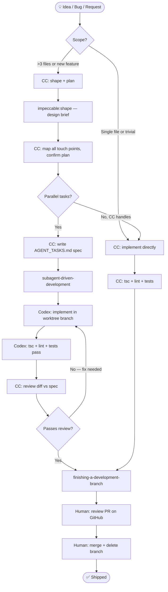
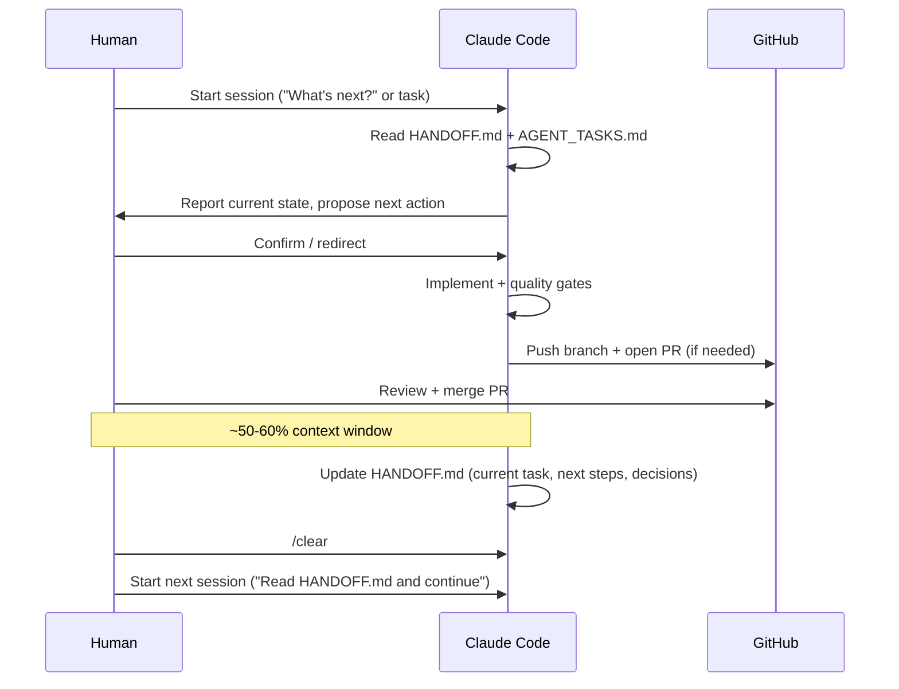
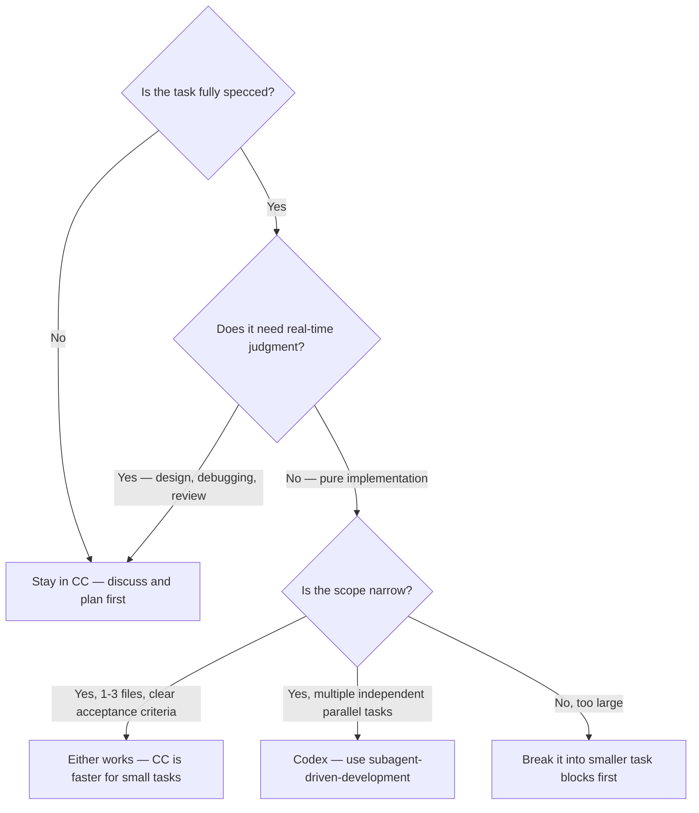

# Workflow Guide

How the human engineer, Claude Code (CC), and Codex work together in this codebase — from idea to shipped feature.

---

## The Three-Actor Model

| Actor | Tool | Strengths | Does NOT |
|---|---|---|---|
| **Human** | You | Context, taste, final decisions | Write boilerplate |
| **Claude Code** | Interactive CLI session | Planning, design, review, orchestration, debugging, UX judgment | Run unattended jobs |
| **Codex** | OpenAI Codex (background agent) | Isolated implementation of scoped specs | Plan, design, merge to main |

CC is your primary collaborator. Codex is a specialized implementer — it receives a precise spec and executes it in isolation.

---

## End-to-End Workflow



---

## Workflow Phases

### 1. Ideation
- Discuss freely with CC — no tooling needed.
- For open-ended brainstorming, CC stays conversational until something concrete emerges.
- For feature requests from users, log to [features page](/features) or the chosen feedback tool.

### 2. Design (UI/UX work)
- CC invokes `impeccable:shape` to produce a task-scoped design brief before writing any code.
- Design constraints live in `.impeccable.md` — CC reads it automatically before UI work.
- Do not write UI code before `impeccable:shape` completes; output is generic without it.

### 3. Planning
- For any change touching >3 files, CC maps all touch points and confirms with you before acting.
- The canonical plan format is `docs/planning-template.md`.
- Once a plan is approved, CC writes the spec into `docs/AGENT_TASKS.md`.

### 4. Implementation

**CC handles directly when:**
- Single-file or simple multi-file edits
- Bug fixes, refactors, configuration
- UI/visual changes
- Anything requiring real-time judgment or back-and-forth

**Codex handles when:**
- Task is fully specced in AGENT_TASKS.md (exact files, acceptance criteria)
- Work is independent (no active CC context required)
- Multiple parallel tasks exist

CC invokes `subagent-driven-development` to dispatch Codex tasks. Each Codex session runs in an isolated git worktree (separate branch), so parallel work can't conflict.

### 5. Review & Validation Evidence

Quality gates (mandatory for all PRs):
- `npx tsc --noEmit` — clean
- `npm run lint` — clean
- `npm test` — all pass

Skill invocations (as applicable):
- CC runs `simplify`, `security-review`, and `impeccable:audit` where appropriate.
- Codex output: CC reviews the diff against the spec before a PR is opened.

**Validation evidence in the PR body is required — not optional.** The goal: anyone can open the PR and know in under 30 seconds what changed, that it works, and what would break if it regressed.

| Change type | Evidence required |
|---|---|
| Bug fix | Test name(s) added; one-line description of what each catches |
| UI/visual change | Before + after `preview_screenshot` with `Before:` / `After:` labels |
| New feature (UI) | Screenshot or Loom of the golden path; edge cases noted |
| New feature (API/logic) | Test names + example request/response or log output |
| Refactor | "Behaviour unchanged" — test pass count before and after |
| Docs/config | What changed and why; no media required |

**Bug fix rule — "fixed" means tests prove it:**
1. Write the failing test *before* the fix. If you can't, explain why in the PR.
2. Run the full suite after fixing to confirm no regressions.
3. Name the added test(s) in the PR body.

**UI screenshot workflow (CC):**
1. `preview_start` → capture `preview_screenshot` of the *current* state (before).
2. Make the change, reload, capture `preview_screenshot` of the *after* state.
3. Paste both into the PR body with `Before:` / `After:` labels.
4. For interaction flows (click, form, animation): describe reproduction steps or link a Loom.

**Codex note:** Codex has no browser access. CC performs all screenshot capture during the review phase for Codex-implemented UI tasks. This is a non-negotiable step before opening a PR for any Codex task that touches the UI.

### 6. Ship
- CC (or Codex) opens a PR via `gh pr create`.
- **Human reviews, approves, and merges on GitHub.** Neither CC nor Codex merges to main.
- Branch is deleted on merge.

---

## Automatic vs Manual

### Automatic (CC does without being asked)
| Trigger | CC action |
|---|---|
| Session start | Invoke `using-superpowers`, read HANDOFF.md, report AGENT_TASKS.md status |
| UI/design work | Check `.impeccable.md`, invoke `impeccable:shape` before coding |
| New feature >3 files | Map touch points, confirm plan |
| `src/lib/providers/` touched | Invoke `claude-api` (preserves prompt caching) |
| New Next.js page/route | Invoke `vercel-react-best-practices` |
| New reusable component | Invoke `vercel-composition-patterns` |
| Supabase work | Invoke `supabase` + `supabase-postgres-best-practices` |
| After non-trivial code change | Invoke `simplify` |
| After significant UI component | Invoke `impeccable:audit` |
| Auth/API route changes | Invoke `security-review` |
| ~50-60% context window | Update HANDOFF.md, then you run `/clear` |

### Manual (requires your action)
| Task | Why manual |
|---|---|
| Merge PRs | Human judgment; agents never touch main |
| Supabase migrations | Run in Supabase dashboard SQL editor |
| Deploy to production | `vercel deploy` or Vercel CI on merge |
| Feature tooling decisions (Canny, Frill, etc.) | Product judgment |
| `.env.local` changes | Security boundary |
| Approve architectural changes | Human owns the roadmap |

---

## Session Lifecycle



**Key rule:** CC updates HANDOFF.md before context runs out. This is the only state that persists across `/clear`. If HANDOFF.md is stale, the next session starts blind.

---

## File Ownership Map

```
HANDOFF.md              ← CC session continuity. Updated by CC, read at session start.
docs/AGENT_TASKS.md     ← Live Codex/subagent specs. CC writes, Codex executes.
docs/workflow.md        ← This file. How the whole system works.
docs/architecture.md    ← Tech stack, providers, routes, hooks. CC reads before architectural work.
docs/conventions.md     ← Coding + UI rules. CC enforces automatically.
docs/environment.md     ← All env vars. Update when adding new vars.
docs/multi-agent.md     ← Worktree rules, git workflow, Codex token limits.
docs/planning-template.md ← Template for Orchestrator → Implementer handoffs.
AGENTS.md               ← Master agent rulebook. Injected into CC, Codex, and all other agents.
CLAUDE.md               ← CC-specific entry; loads AGENTS.md via @reference.
.impeccable.md          ← Design system context. CC reads before any UI work.
```

---

## When to Use Codex vs CC



**Rule of thumb:** If you can write the spec in 10 minutes and it has clear acceptance criteria, it's ready for Codex. If it requires taste, iteration, or context from this conversation, keep it in CC.

---

## Keeping This System in Sync

**When anything in the workflow changes** (new skill added, file renamed, convention updated, tool deprecated):

1. Update the relevant `docs/` file.
2. Update `AGENTS.md` if the change affects agent behavior.
3. Update this file if the change affects how humans and agents interface.
4. Update `HANDOFF.md` to note the change in the current session's decisions.

CC is responsible for flagging when docs are stale and proposing updates as part of normal work. Never let a session end with undocumented architectural or workflow decisions.

---

## Quick Reference: Key Commands

```bash
# Dev
npm run dev          # Next.js with Turbopack
npm run build        # Production build
npm run lint         # ESLint
npm test             # Vitest
npx tsc --noEmit     # Type-check

# Git
git fetch origin && git pull origin main   # Always pull fresh before starting
gh pr create --title "..." --body "..."    # Open a PR (CC does this; human merges)

# Context management
/clear               # Start fresh session (update HANDOFF.md first)
```
